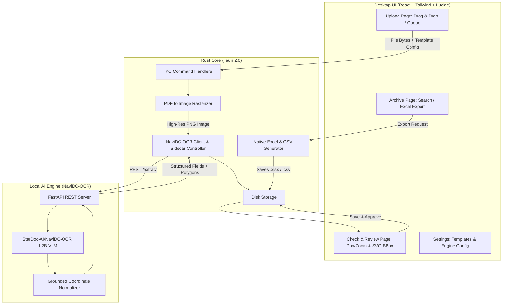

# Fatrocu System Architecture & Pipeline

### Key Technical Specs:
- **Vision-Language Model**: `StarDoc-AI/NaviDC-OCR` (1.2B lightweight model based on Qwen2.5-VL architecture).
- **Desktop Runtime**: Tauri 2.0 on Windows (`WebView2` + Rust native backend).
- **Persistence**: JSON / binary cache in `%APPDATA%\Fatrocu`.
- **Excel Output**: Direct XLSX binary output via `rust_xlsxwriter` (no Excel/Office dependency).
